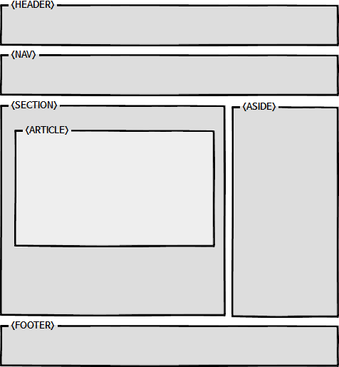

# 1. HTML

## 1.1. 개요

> 하이퍼텍스트 마크업 언어는 웹 페이지를 위한 지배적인 마크업 언어다. HTML은 제목, 단락, 목록 등과 같은 본문을 위한 구조적 의미를 나타내는 것뿐만 아니라 링크, 인용과 그 밖의 항목으로 구조적 문서를 만들 수 있는 방법을 제공한다. - 위키백과

## 1.2. 참고

- <https://webdir.tistory.com/310>

## 1.3. HEADER, NAV, SECTION, ASIDE, FOOTER

- HTML5에 새로 추가된 요소이다. 위와같이 정의해 주면 봇 등이 사이트를 쉽게 파악할 수 있다.
- HEADER: 웹사이트 어느 곳에서든지 이용할 수 있는 링크들이 있다.
- NAV: 목적지로 이동할 수 있도록 링크를 별도로 모아둔 영역
- SECTION: 같은 성격의 내용, 즉 관련있는 내용을 section 요소로 묶어 표시
- ASIDE: 흔히 사이드바라고 부르는 영역으로 배너, 용어 설명, 관련 상품 등 본문 내용과 직접적인 관련성이 적거나 없는 내용으로 구성된다.
- FOOTER: 웹 문서 맨 아래쪽에 있으며 저작권, 연락처등으로 구성된 영역이다
