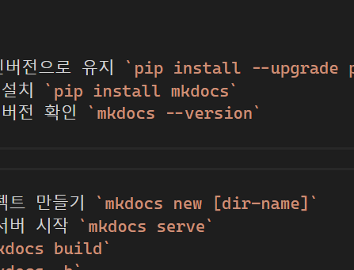
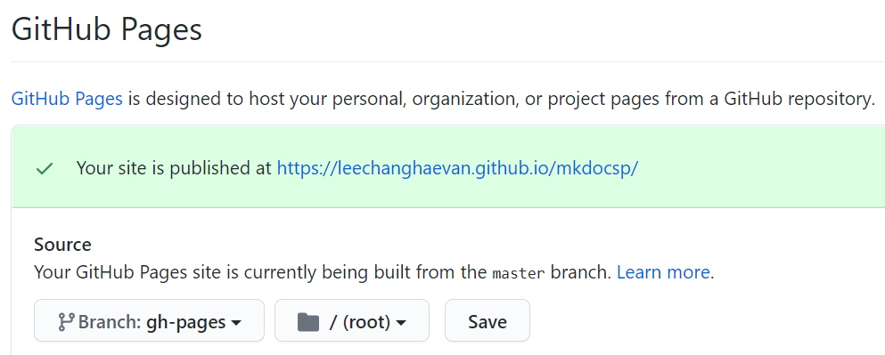

# Mkdocs

## 개요

- mkdocs는 마크 다운 기반의 웹문서 생성기이다. 본 사이트를 만드는데 사용되었다.
- mkdocs를 설치하기 위해선 파이썬 매니저인 pip가 설치되어 있어야 한다.

## 사전필요

- 파이썬 설치 [(이동)](python.md)  
  <http://www.python.org/downloads>
- pip 설치  
  `curl https://bootstrap.pypa.io/get-pip.py -o get-pip.py.`  
  `python get-pip.py.`
- 아나콘다로 (파이썬 + pip) 한번에 설치  
  <https://docs.anaconda.com/anaconda/install/>

## 설치

- pip 최신버전으로 유지 `pip install --upgrade pip`
- mkdocs 설치 `pip install mkdocs`
- mkdocs 버전 확인 `mkdocs --version`

## 명령어

- 새 프로젝트 만들기 `mkdocs new [dir-name]` + 폴더 이동 `cd [dir-name]`
- 테스트 서버 시작 `mkdocs serve` (핫리로드 지원됨)
- 빌드 `mkdocs build`
- 헬프 `mkdocs -h`

## 설정 파일 (mkdocs.yml)

- 사이트 이름 설정
  >     site_name: [내사이트]
- 사이트 메뉴 설정
  >     nav:
  >         - Home: index.md
  >         - About: about.md
  >         ...

## 문법

- 일반적인 마크다운 문법을 따른다.
- 이미지 삽입 방법
  >     경로: docs/img/2020-12-29-03-05-21.png
  >     링크: 
  >
  > vscode에서 Ctrl+Alt+V 누르면 클립보드 이미지가 파일로 저장되면서 링크도 생성된다. (Markdown Paste 확장)

## Github Pages에 배포

- 따로 build 할 필요없이 아래 명령어를 실행하면, 빌드후 자동으로 gh-pages 브랜치에 push된다.
  `mkdocs gh-deploy`
- GitHub Pages 설정에 가서 Source 브랜치를 `gh-pages`로 변경하자. [그림 1-0]

> [그림 1-0] 

---

참고

1. [mkdocs.org](https://www.mkdocs.org/)
